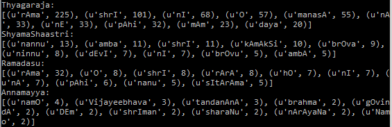

# carnaticNet
Analyzing the poetry of South Indian Classical composers and what they can convey about the sacred art form.

#### scrapeLyrics.py
Demo web scraping of the "Pallavi" (refrain, chorus) of compositions from www.karnatik.com. Demo prints the 10 most common words used by composers Thyagaraja (c 1767-1847), Shyama Sastri (c 1762-1827), Ramadasu (c 1620-1680) and Anamaarcharya (c 1408-1503). 

To run: 
>>python scrapeLyrics.py

Sample output (may change if website changes):

Of note:
- 880 songs' refrains scraped (four songs did not explicity include a marked Pallavi)
- The most commonly used words of Thyagaraja and Ramadasu were the same, "Rama," the name of their ishta devata, or favorite form of God.
- There is alot more data for Thyagaraja. This is actually because there are many more compositions of his recorded on karnatik.com, not because there are more words per composition necessarily; that would be an interesting additional question. Moreover, including information about the coexistence of words within a composition would be useful. 
- The frequency of ShyamaShaastri's use of the words for "me" and "you," ("nannu," "ninnu") can give us some insight about their poetic style that lines up with what I, as a non-expert, might be able to still observe about his compositions.
- Annamayya list of most common words includes some that one may not expect to necessarily be common. "tandanAnA" is one such word; but this actually reflects Annamayya's use of repetition within compositions! Another reason why information of composition context would be useful.
- There are hurdles to using a transliterated dataset! Karnatik.com tends to have a consistent transliteration standard utilizing capitalization, which is why it was selected. However, an example where words are potentially unnecessarily treated as different is the inclusion of "amba" and "ambA" as two different words for ShyamaShaastri (possibly capitalized differently because it is sung slightly differently in the compositions).